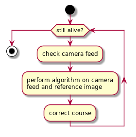

# Image Oriented Homing Guidance

## Overview
**IMage Oriented HOming GUidance** or (**IMOHOGU**) is a process that guides a UAV to a chosen target.

#### Disclaimers 
- This spec is not complete.

- This spec does not discuss the inner workings of the program. It does however mention possible solutions to the problem.

  
## Scenarios
- **Scenario 1 : Easily visible target** 
In this scenario, the UAV target is one distinct object with no other objects around it, that would potentially
obstruct it. The image of the target given to the UAV prior to the mission; however the UAV camera picks up
the object from a different angle.

- **Scenario 2 : Target surrounded by other similar objects** 
This time, the target object must be identified and not get confused with objects surrounding it. This means that the
objects in the scene should be enumerated and have their topological relationship understood by the program. This could
be accomplished by using the UAV's coordinates and the **travel_assist** (DSMAC) program to cross-validate if what the 
front camera sees is indeed located where the UAV should head.

## Non Goals
**This will not support the following features**

- **Avoiding obstructing objects:** 
This program is not meant to provide the UAV with a complex maneuvering system. It is not expected of the missile to have
it's view obstructed by another object, since it is flying at a reasonably high altitude and additionally the targets selected
are picked in a way such a way so that there won't be anything obstructing the target.

- **Guiding the missile in low altitudes:** 
The missile is dependant of the travel_assist program to guide it through great distances.  
 
## Flowchart
Here is a quick look on how the program should operate

## Algorithm candidates  
Here is a list of algorithms that could tackle this problem.

- [YOLO : You Only Look Once](https://pjreddie.com/darknet/yolo/)
- [SIFT : Scale Invariant Feature Transform](https://opencv-python-tutroals.readthedocs.io/en/latest/py_tutorials/py_feature2d/py_sift_intro/py_sift_intro.html)
- [A Gentle Introduction to Object Recognition With Deep Learning](https://machinelearningmastery.com/object-recognition-with-deep-learning/)
