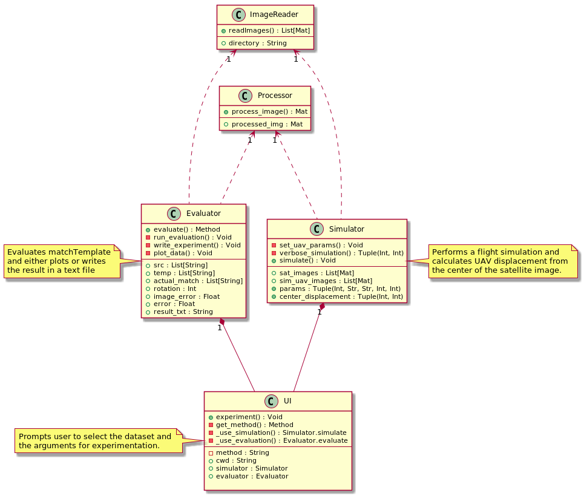

## Abstract
This project uses OpenCV's Template Matching to match one satellite image and one UAV image and find where the image taken by the drone is relative to the satellite image

Note : This program has been tested on a variety of images, containing different amount of features, noise and blur.

## Program Guide
- Simulator : Runs a simulation of a UAV flight itinerary. Multiple 'satellite' images are given as input, as well as parameters for the UAV course and INS error. The program performs template matching on each image and computes the distance of the sensed location from the center of the image. The predicted distances are then transferred to the next image, and the process is repeated until there are no more images.
- Evaluator : Runs the matching algorithm on multiple sub-regions of an image, on a set of images with various amounts of features. After the evaluation is complete, the experiment data can either be outputted into experiment-results.txt or be plotted using matplotlib.

## Program structure
Here is the program's class diagram

  
# Project resources

### Digital Scene Matching Area Correlator

 - [DSMAC : Image Processing for Tomahawk scene matching](https://www.jhuapl.edu/Content/techdigest/pdf/V15-N03/15-03-Irani.pdf)
 
#
### Template Matching

- [Template matching wiki](https://en.wikipedia.org/wiki/Template_matching)
- [Template matching OpenCV](https://docs.opencv.org/2.4/doc/tutorials/imgproc/histograms/template_matching/template_matching.html)
- [Template matching source code](https://github.com/opencv/opencv/blob/master/modules/imgproc/src/templmatch.cpp)
